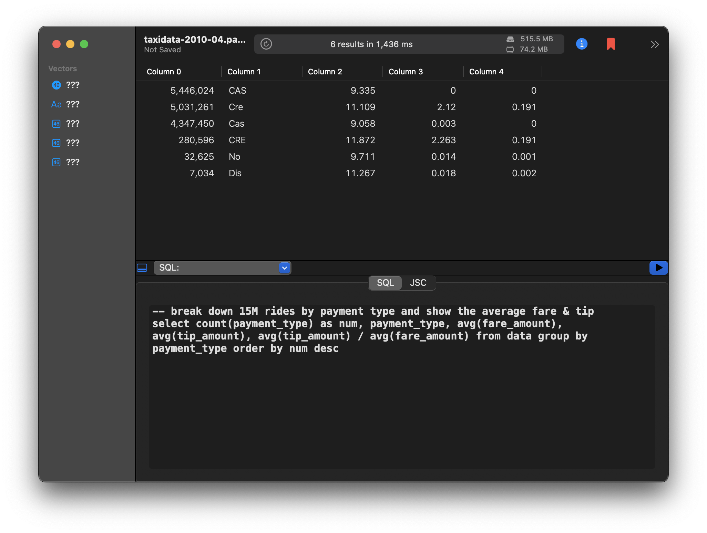

# Parquette!

Prototype of embedding Arrow & DataFusion Rust libraries in a Swift macOS app via cbindgen interfaces and sharing the zero-copy arrays with Rust's wasm-bindgen JavaScript equivalent.

Download the latest build from https://github.com/parquette/parquette/releases/latest/. It is deployed frequently and automatically incorporates the latest DataFusion 4.0.0-SNAPSHOT (https://docs.rs/datafusion/).

The app can open `.csv`. & `.parquet` files and execute rudimentary SQL. 

A good example file is a 515MB [NYC April 2010 Taxi Data](https://ursa-labs-taxi-data.s3.us-east-2.amazonaws.com/2010/004/data.parquet) parquet file. See (https://cran.r-project.org/web/packages/arrow/vignettes/dataset.html) for schema info.

